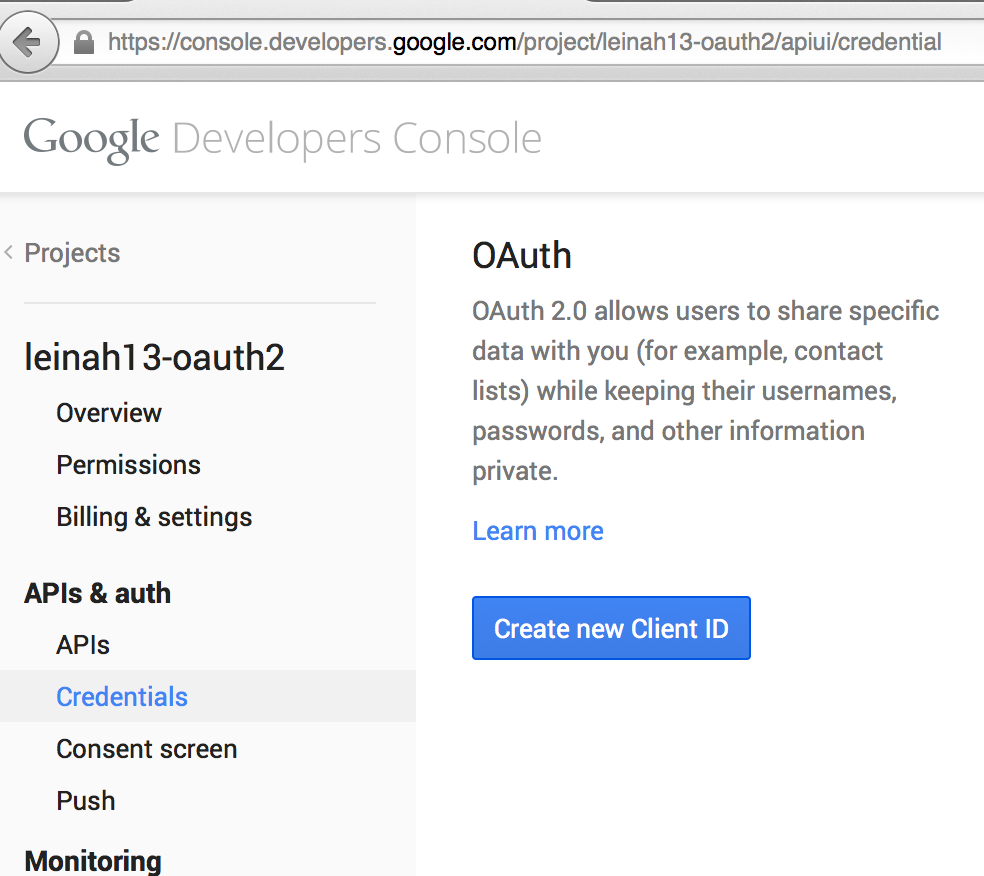
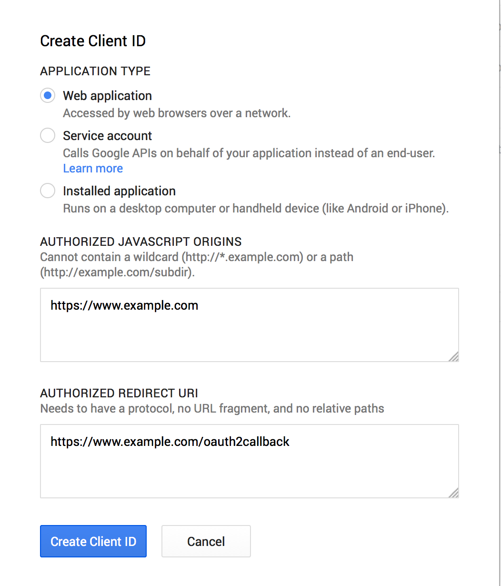

# Autenticación Con Google (oauth2)
---------
---------

##Obejtivo:

Resgitrarse a la aplicación mediante Google, y que sea Google quien nos proporcione los datos necesarios. Usando asi el sistema de seguridad de Google.

##Su funcionamiento:

###Desarrollador:

Tenemos que entrar a [aquí](https://code.google.com/apis/console/). Donde nos registramos, creamos una aplicación web.

Elegimos el tipo de aplicación, y copiamos el id de usuario y contraseña que copiaremos en config.yml sin comillas.

Recordar poner los enlaces que estemos usando por ejemplo : 'localhost:9292' + la ruta.

###Usuario:
	
Para ver la finalidad del proyecto entre [aquí](http://leinah-oauth2.herokuapp.com/).

------

Haniel